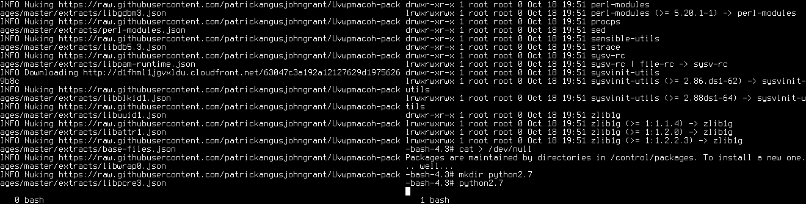

# Uvwpmacoh
Uvwpmacoh, pronounced "uv-wup-mac-oh", stands for Ubuntu Variant With Package
Management And Configuration Over HTTP. It is an experimental distribution
which exploits a few ideas which somehow loosely tie together:
 - Avoiding implementing userspace tooling. Everything that can be is
   implemented using FUSE bindings. For example, daemon control and packages
   installation can be done with mkdir().
 - Every file on the filesystem is tracked by the FUSE daemon. Package manager
   owned files (like /bin/bash, and everything it links to) are lazily
   downloaded over HTTP as and when they're needed.

#FAQ

## Why??!

I don't like:

* locally hacked configuration management
* scripted configuration management
* convergent configuration management
* DSLs
* protocols other than HTTP
* compiling stuff I didn't write
* package managers that download stuff which is never even used
* writing long programs in languages without good type safety
* ...but at the same time, I'm hardly fond of Java
* etc

I could bang on at length about my distaste for any of the above.

This project is really my attempt to see what remains when you take away all them.

# That sounds very negative. How about you take that all and spin it in a positive light?

Sure! I'd love to!

Uvwpmacoh offers:
* *Declarative configuration*. Declarative is a *really good way* to deal with
  stuff. Facts are stated. Think of something like "chmod -R 700
  /my/directory". What happens when it fails? And what about the window before
  it's run? Should it continue? Should everything else carry on? Should it be
  run again? With Uvwpmacoh those don't even need to be questions! It's just...
  declarative. The chmod has essentially *already been done* on another machine
  and imported as JSON.
* *Standard protocols*. Well, one standard protocol -- HTTP. It's not that good
  and it's not that bad. It is what it is and it's the workhorse of the web,
  and I hear that thing might go somewhere some day. How many weird and
  wonderful protocols are there out there in the world of systems? Some of them
  are more standard than others, some of them are easier to set up than others,
  and so on. With HTTP you don't need to set up a weird server on your network,
  you can use commodity webhosting. You can leverage HTTP caching provided by
  your ISP.
* *JSON*. Okay okay it's not that good. It's not that bad either! Your
  favourite language can already emit it and you can already read it. Uvwpmacoh
  doesn't really care and could use XML some day, or YAML, or TOML, or
  whatever else is cool in your ridiculous future.
* *Ruthless POSIX abuse*. All interaction is done through FUSE. So your
  favourite language already has native support.
* *All seeing knowledge*. Think you can sneak in your own config in /etc
  somewhere? Pah! It's *got* to come via a package, buddy. You want to write
  something temporaryish to /var/spool? All you need to back up is the *one
  file* responsible for filesystem exports -- /control/system. And this isn't a
  simple tar of the root filesystem. It's the minimal configuration you would
  need to restore the system as it currently stands, which means it's way
  smaller, and way more useful.
* *Active process monitoring*. Because of Uvwpmacoh's unique position as
  filesystem *and* init (stop wretching, you at the back!), it can wait() for
  processes and then immediately restart them without polling anything. It can
  also expose useful information about the daemon through the filesystem --
  /control/daemons/apache/pid is guaranteed to always be a current symlink to
  the /proc/$pid/ of the apache.
* *Starting the box is installing the system*. This is a really powerful
  paradigm shift. It's the same thing as when you run a webapp in your browser
  -- it's loaded in fresh every time. It's not perfect for every type of app,
  hence desktop apps still being a thing, but you can get a hell of a long way
  with it. Let's take those ephemeral installs and make them even more
  fleeting.
* *And loads more!*. Did I mention that you can generate any file on the
  filesystem dynamically from any language by just writing a CGI, and this will
  only be generated when it's needed?
* *And loads to come!*. Imagine if caching to local disk worked -- that would
  be a really neat and intuitive half-way house. Or HTTP push. Lots of existing
  really boring tech out there to reuse in a new an interesting way.

# How do I try it out?

* Start up and log on:
 * Fork this repository
 * cd ./initramfs
 * ./run.sh
  * Keep an eye on this window!
 * *wait*
 * ssh localhost -lroot -p2222
 * password is "password"
* Check out the magical /etc/motd
 * cat /etc/motd
 * See how this is derived from [the definition](https://github.com/patrickangusjohngrant/Uvwpmacoh-packages/blob/master/system_definitions/default.json)
* Test out the packages:
 * cd /control/packages/bash
 * find contents/
 * Compare this with [the definition](http://github.com/patrickangusjohngrant/Uvwpmacoh-packages/blob/master/extracts/bash.json)
* Install python:
 * mkdir /control/packages/python2.7
 * python2.7
* Test out daemons:
 * cd /control/daemons
 * mkdir hello
 * cd hello/argv
 * echo -n /usr/bin/python2.7 > 1
 * echo -n -m > 2
 * echo -n SimpleHTTPServer > 3
 * cd ..
 * echo -n true > enabled
 * ls -lah
 * Note the symlink to /proc/&lt;pid&gt;
 * On your desktop, open [http://localhost:8000/](http://localhost:8000/)
* Test breaking stuff:
 * Kill the SimpleHTTPServer daemon
 * Try corrupting /bin/bash
* More stuff in /control
 * /control/log provides internal log messages
 * /control/system allows an export of the live system

# Typing sounds like a lot of work. Can you demonstrate some other way?

You might need to [view the raw image](https://raw.githubusercontent.com/patrickangusjohngrant/Uvwpmacoh/master/uvwpmacoh.gif) for full effect.

# I'd like to provide some feedback

Wonderful! Email uvwpmacoh@some.stupid.name
